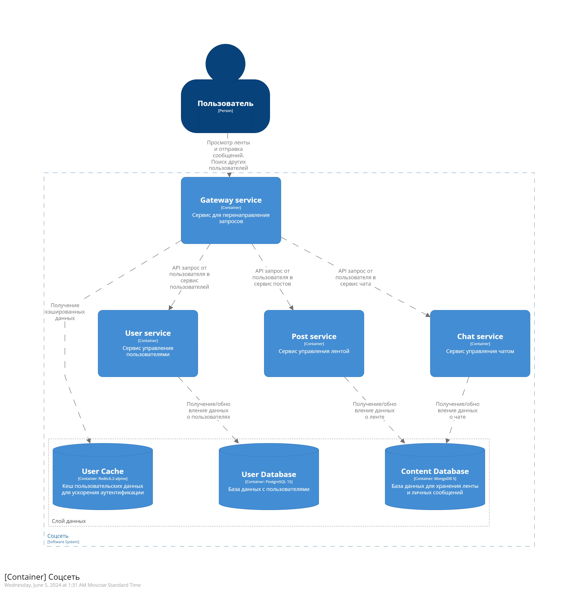
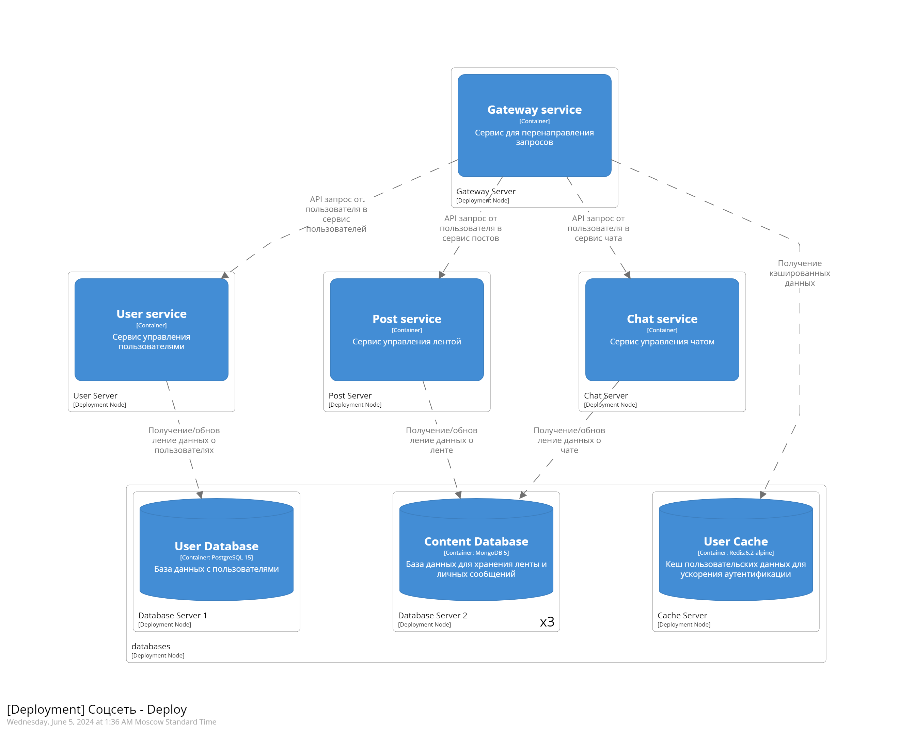
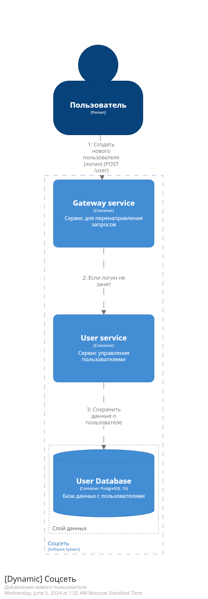
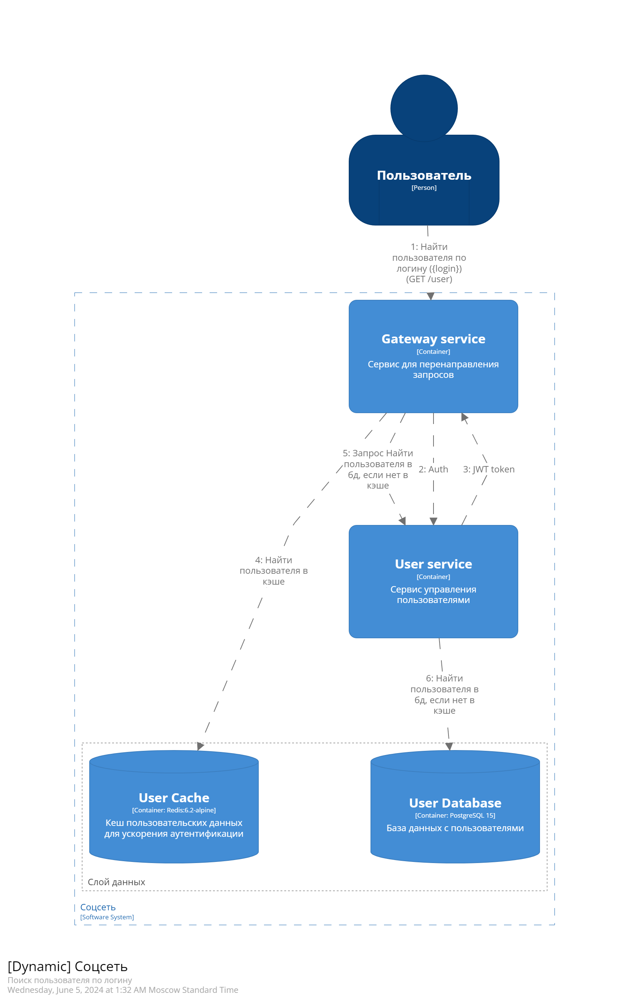
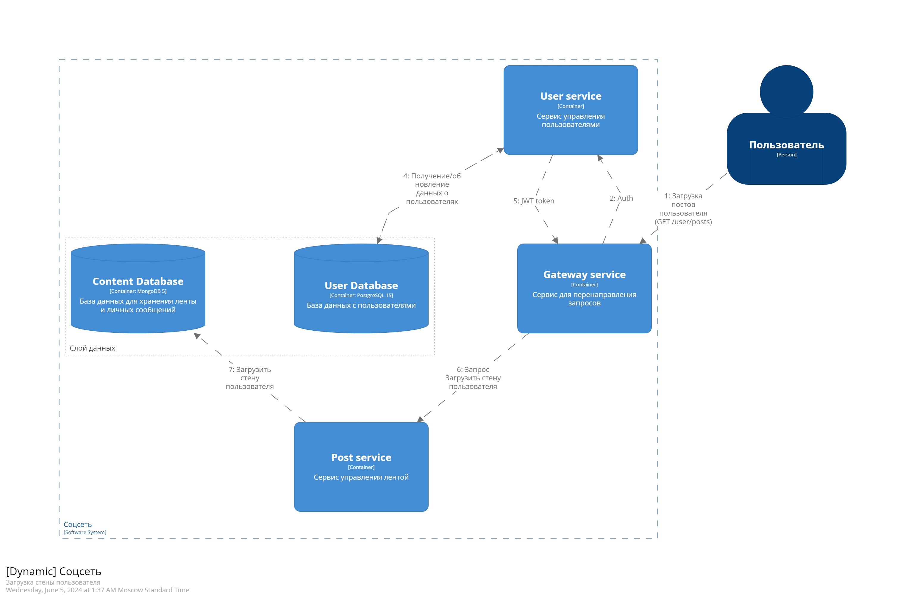

# Социальная сеть 

| Группа      | Вариант | Создатель   | 
|-------------|---------|-------------|
| М8О-109М-23 |     1   | Гаев Роман  | 

## Описание приложения
### Приложение должно содержать следующие данные:
- Пользователь
- Стена
- Сообщения чата (PtP)
### Реализовать API:
- Создание нового пользователя
- Поиск пользователя по логину
- Поиск пользователя по маске имя и фамилии
- Добавление записи на стену
- Загрузка стены пользователя
- Отправка сообщения пользователю
- Получение списка сообщения для пользователя
## Задание 01: Проектирование программной системы (Architecture As A Code)
### Цель
Ознакомится с инструментами проектирования в формате Architecture As A Code.
Получить практический навык в моделировании в нотации C4
### Задание
- [x] 1. Установить инструменты из списка
   - Клиент Git
   - Текстовый редактор (рекомендуется Visual Studio Code)
   - Плагины к Visual Studio Code C4 DSL
- [x] 2. Зарегистрироваться на github.com (если еще нет учетной записи)
- [x] 3. Создать публичный репозиторий для выполнения практической работы у себя в
аккаунте
- [x] 4. Скопировать репозиторий https://github.com/DVDemon/hl_mai_lab_00 с
примерами задания
- [x] 5. Создать файлы с описанием «архитектуры» согласно вашему варианту задания
в Structurizr Lite.
- [ ] 6. Требования к диаграммам:
   - [ ] - Должна быть контекстная диаграмма
   - [ ] - Должна быть диаграмма контейнеров
   - [ ] - Должна быть диаграмма развертывания
   - [ ] - Должно быть несколько динамических диаграмм
### Архитектура

#### Динамические диаграммы

