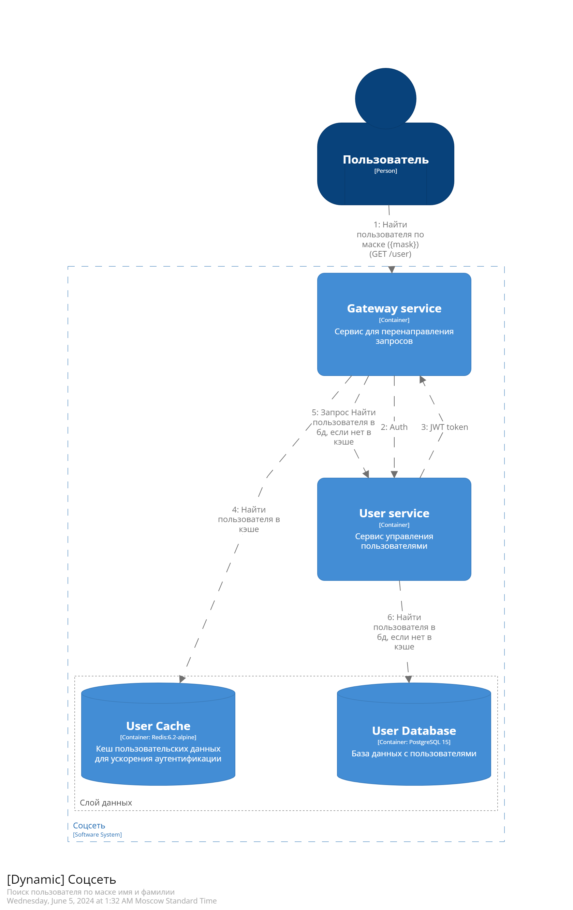
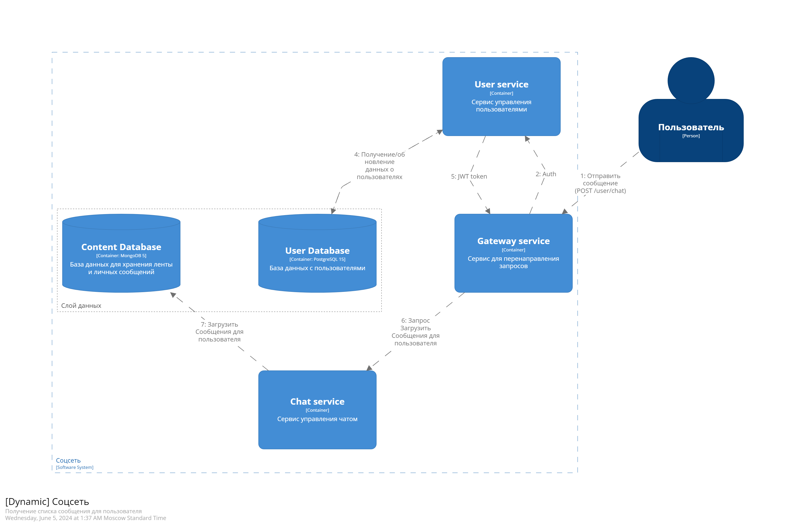

# Задание 01: Проектирование программной системы (Architecture As A Code)
## Цель
Ознакомится с инструментами проектирования в формате Architecture As A Code.
Получить практический навык в моделировании в нотации C4
## Задание
- [x] 1. Установить инструменты из списка
   - Клиент Git
   - Текстовый редактор (рекомендуется Visual Studio Code)
   - Плагины к Visual Studio Code C4 DSL
- [x] 2. Зарегистрироваться на github.com (если еще нет учетной записи)
- [x] 3. Создать публичный репозиторий для выполнения практической работы у себя в
аккаунте
- [x] 4. Скопировать репозиторий https://github.com/DVDemon/hl_mai_lab_00 с
примерами задания
- [x] 5. Создать файлы с описанием «архитектуры» согласно вашему варианту задания
в Structurizr Lite.
- [x] 6. Требования к диаграммам:
   - [x] - Должна быть контекстная диаграмма
   - [x] - Должна быть диаграмма контейнеров
   - [x] - Должна быть диаграмма развертывания
   - [x] - Должно быть несколько динамических диаграмм
## Архитектура

 

### Динамические диаграммы

